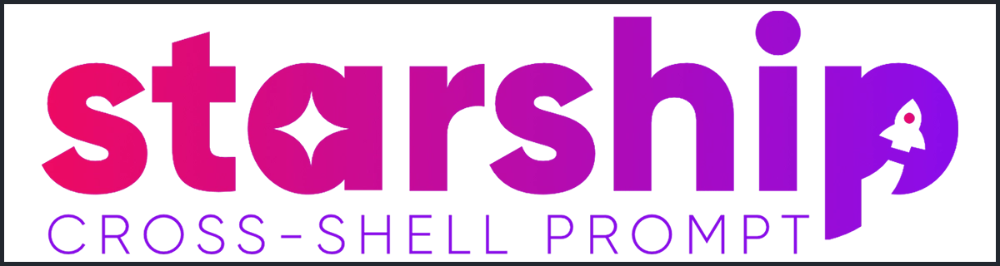

# Terminal

## General

Create symlink for custom bashprofile.

```bash
$ ln -sf ~/.dotfiles/bashrc/.bashrc ~/.bashrc
```

For the bashprofile to work correctly, a few additional packages are necessary to be installed. Neofetch for initial sessions, and eza for color-ls.

```bash
# install neofetch
$ sudo pacman -S neofetch eza

# remove default config directory
$ rm -rf ~/.config/neofetch

# create config symlink
$ ln -sf ~/.dotfiles/neofetch ~/.config/neofetch
```

## Alacritty Terminal Emulator

<br/>
<div align="center">
    
</div>

<br/>

###  Installation

To install alacritty and use the custom configuration, run the following commands manually:

```bash
# Install via pacman
$ sudo pacman -S alacritty

# remove default config directory
$ rm -rf ~/.config/alacritty

# setup config symlink
$ ln -sf ~/.dotfiles/alacritty
```

## Starship Cross-Shell Prompt

<br/>
<div align="center">
    
</div>

<br/>

### Installation

Install starship on system using command:

```bash
$ curl -sS https://starship.rs/install.sh | sh
```