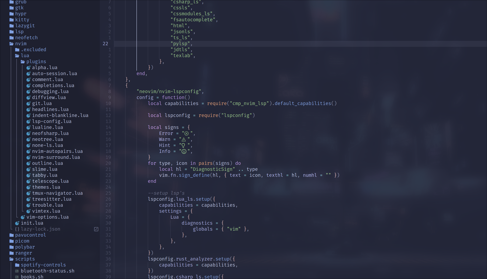
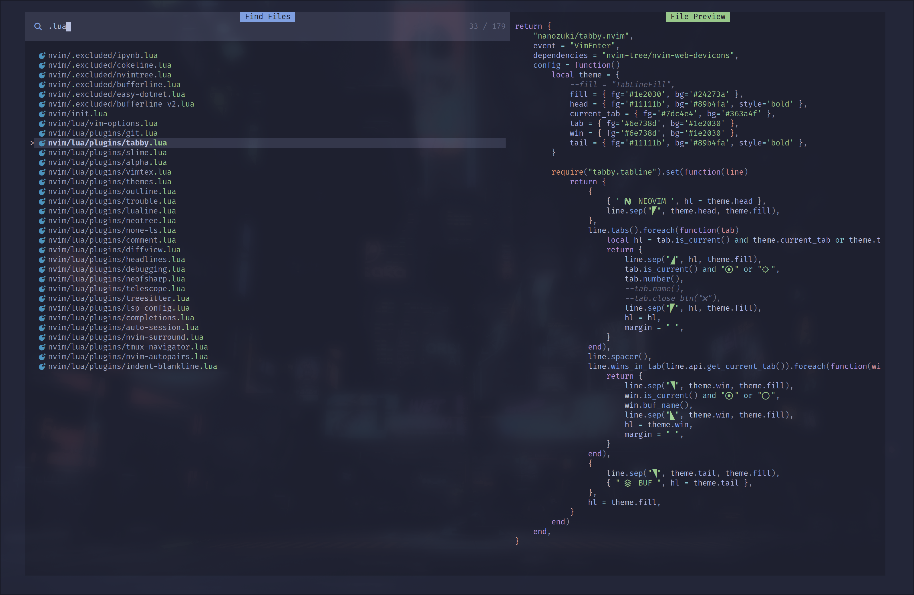

# .dotfiles

[](https://hyprland.org/)
[](https://github.com/hyprwm/hyprlock)
[](https://github.com/Alexays/Waybar)
[](https://github.com/alacritty/alacritty)
[](https://www.gnu.org/software/bash/manual/bash.html)
[](https://github.com/pwmt/zathura)
[](https://github.com/sddm/sddm)


## Contents

- [Neovim]()
- [Installation](#installation)


## Neovim

<br/>

<div align="center">
  
</div>

<br/>
<br/>


<details>
    <summary>File Navigation</summary>
    <br/>
    <ul>
        <li><a href="https://github.com/nvim-telescope/telescope.nvim">Telescope</a> - Fuzzyfinder for files, buffers, and a bunch of other stuff.</li>
        <li><a href="https://github.com/nvim-neo-tree/neo-tree.nvim">Neotree</a> - File tree, open buffers or git changes.</li>
    </ul>
    <br/>
    <div align="center">
        
    </div>
    <div align="center">
        
    </div>
    <br/>
</details>

<details>
    <summary>Git</summary>
    <br/>
    <ul>
        <li><a href="https://github.com/nvim-telescope/telescope.nvim">Neogit</a> - Git UI for Neovim.</li>
        <li><a href="https://github.com/nvim-neo-tree/neo-tree.nvim">Gitsigns</a> - Displaying git changes in open buffers.</li>
        <li><a href="https://github.com/nvim-neo-tree/neo-tree.nvim">diffview.nvim</a> - Diffview for current buffer.</li>
    </ul>
    <br/>
</details>

<details>
    <summary>Stuff for making life easier</summary>
    <br/>
    <ul>
        <li><a href="https://github.com/nvim-telescope/telescope.nvim">auto-session</a> - Jump right back into last sesh.</li>
        <li><a href="https://github.com/nvim-neo-tree/neo-tree.nvim">comment.nvim</a> - For commenting out stuff.</li>
        <li><a href="https://github.com/nvim-neo-tree/neo-tree.nvim">nvim-autopairs</a> - Close brace pairs automatically.</li>
        <li><a href="https://github.com/nvim-neo-tree/neo-tree.nvim">nvim-surround</a> - Easy surround with braces</li>
    </ul>
    <br/>
</details>

### Custom Keymaps

| Mode | Keymap | Description | Command |
|-|-|-|-|
| NORMAL | `<C-h>` | Move to window left of current | `:wincmd h<CR>` |
| NORMAL | `<C-j>` | Move to window below current | `:wincmd j<CR>` |
| NORMAL | `<C-k>` | Move to window above current | `:wincmd k<CR>` |
| NORMAL | `<C-l>` | Move to window right of current | `:wincmd l<CR>` |
| NORMAL | `<S-Up>` | Vertical resize current window | `:resize +2<CR>` |
| NORMAL | `<S-Down>` | Vertical resize current window| `:resize -2<CR>` |
| NORMAL | `<S-Left>` | Horizontal resize current window | `:vertical resize +2<CR>` |
| NORMAL | `<S-Right>` | Horizontal resize current window | `:vertical resize -2<CR>` |
| NORMAL | `<leader>n` | Navigates to next buffer | `:bnext<CR>` |
| NORMAL | `<leader>p` | Navigates to previous buffer | `:bprev<CR>` |
| NORMAL | `<C-s>` | Writes changes to current buffer | `:w<CR>` |
| NORMAL | `<C-q>` | Quits current buffer | `:q<CR>` |
| NORMAL | `<leader>wq` | Writes changes and quits all buffers | `:wqa<CR>` |
| NORMAL | `<leader>wr` | Toggles line wrapping | `:set wrap! linebreak!<CR>` |
| NORMAL | `<leader>s` | Quick find and replace | `:%s/\<<C-r><C-w>\>/<C-r><C-w>/gI<Left><Left><Left>` |
| NORMAL | `<F2>` | Show tabline | `:set showtabline=2<CR>` |
| NORMAL | `<F3>` | Hide tabline | `:set showtabline=0>` |
| NORMAL | `<S-Tab>` | Navigate next tab | `:tabnext<CR>` |
| NORMAL | `<leader>tn` | Create new tab | `:tabnew \| Alpha<CR>` |
| NORMAL | `<leader>tq` | Navigate next tab | `:tabnext<CR>` |
| VISUAL-LINE | `<leader>p` |  | `\"_dP` |


<br/>

## Installation

```bash
# clone the repository
git clone https://github.com/FLIVLA/.dotfiles.git $HOME/.dotfiles

# Run install script
$HOME/.dotfiles/.install/install.sh
```

### Firefox CSS

- Go to `about:config`, search for `toolkit.legacyUserProfileCustomizations.stylesheets`, and set to `true`.

- Find and copy the current active profile on the `about:profiles` page, then run the following command:

```bash
$HOME/.dotfiles/firefox/setup.sh $HOME/.mozilla/firefox/$profile_dir
```