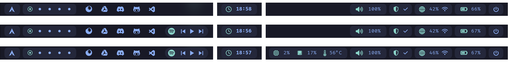
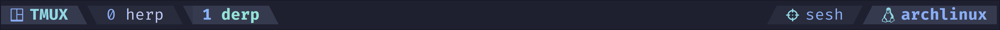
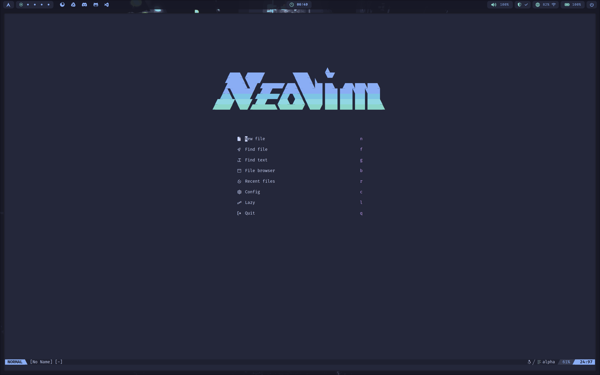

<div align="center">
  
</div>
<br/>
<br/>

[](https://hyprland.org/)
[](https://github.com/hyprwm/hyprlock)
[](https://github.com/hyprwm/hyprlock)
[](https://github.com/Alexays/Waybar)
[](https://github.com/alacritty/alacritty)
[](https://www.gnu.org/software/bash/manual/bash.html)
[](https://www.gnu.org/software/bash/manual/bash.html)
[](https://github.com/pwmt/zathura)
[](https://github.com/sddm/sddm)


# Contents

- [Hyprland](#hyprland)
- [BSPWM](#BSPWM)
- [Waybar / Polybar](#waybar--polybar)
- [Terminal]()
- [TMUX]()
- [Neovim]()
- [Installation](#installation)

<br/>


<br/>
<!-- <div align="center">
  
</div> -->

# Hyprland

## Config

To avoid rewriting config too eften, I have modularized the configuration such that multiple settings-presets exist in [.../hypr/presets](). the presets files simply source  the global settings files and  a combination of  files from the settings directories.  

To change hyprland preset, run `settings` from the terminal if using the provided `.bashrc`, or `~/.dotfiles/scripts/settings.py`. This will open a settigns TUI, where presets can easily be selected. This will replace current symlinks in `~/.config/hypr`.

- [Presets](./hypr/3840x2400/hyprland.conf)
- [Global Settings](./hypr/global/)
- [Window Decorations](./hypr/decorations/)
- [Window Rules](./hypr/windowrules/)

## Keybindings

<div align="center">

| Keymap | Description |
| :--- | :--- |
| `SUPER + Shift + Left arrow` |  Resize horizontal left |
| `SUPER + Shift + Right arrow` |  Resize horizontal right |
| `SUPER + Shift + Up arrow` |  Resize vertically up |
| `SUPER + Shift + Down arrow` |  Resize vertically down |
| `SUPER + Arrow keys` |  Move focus |
| `SUPER + T` | Toggle tile/floating window |
| `SUPER + F` | Toggle full screen |
| `SUPER + 1-?` | Move to workspace |
| `SUPER + Shift + 1-?` | Move active window to workspace |
| `SUPER + Return` | Launch terminal (Alacritty)  |
| `SUPER + Shift + B` | Launch browser (Firefox)  |
| `SUPER + C` | Launch Visual Studio Code |
| `SUPER + Q` | Kill active window |
| `SUPER + M` | Exit hyprland session |
| `SUPER + E` | Launch gui file manager (Thunar) |
| `SUPER + R` | Open application launcher |
| `SUPER + J` | Togglesplit - Check if this works |
| `SUPER + Shift + P` | Screenshot (grim & slurp) |
| `SUPER + L` | Lock screen (hyprlock) |

</div>
<br/>

# BSPWM

hello

## Config

- [bspwmrc](./bspwm/bspwmrc)
- [sxhkdrc](./sxhkd/sxhkdrc)
- [.Xresources](./xorg/.Xresources)

### Scaling issues for high DPI monitors

Add the following lines to `~/.Xresources`.

```ini
Xft.dpi: 140
URxvt.font: xft:<FONT_FACE>:size=12
Xft.autohint: 0
Xft.lsdfilter: lcddefault
Xft.hintstyle: hintslight
Xft.hinting: 1
Xft.antialias: 1
Xft.rgba: rgb
```
To makes changes take effect:

```bash
xrdb -merge ~/.Xresources
```

Found that adding the following lines to `.bashrc`, and adjusting the values solves application scaling issues.

```bash
# GTK scaling settings
export GDK_SCALE=0.5
export GDK_DPI_SCALE=0.5

# Qt scaling for high DPI monitors
export QT_AUTO_SCREEN_SCALE_FACTOR=1
export QT_SCALE_FACTOR=0.5
export QT_CURSOR_SIZE=24
```

## Keybindings (sxhkdrc)

<!-- <div align="center">

| Keymap | Description |
| :--- | :--- |
| `SUPER + Shift + Left arrow` |  Resize horizontal left |
| `SUPER + Shift + Right arrow` |  Resize horizontal right |
| `SUPER + Shift + Up arrow` |  Resize vertically up |
| `SUPER + Shift + Down arrow` |  Resize vertically down |
| `SUPER + Arrow keys` |  Move focus |
| `SUPER + T` | Toggle tile/floating window |
| `SUPER + F` | Toggle full screen |
| `SUPER + 1-?` | Move to workspace |
| `SUPER + Shift + 1-?` | Move active window to workspace |
| `SUPER + Return` | Launch terminal (Alacritty)  |
| `SUPER + Shift + B` | Launch browser (Firefox)  |
| `SUPER + C` | Launch Visual Studio Code |
| `SUPER + Q` | Kill active window |
| `SUPER + M` | Exit hyprland session |
| `SUPER + E` | Launch gui file manager (Thunar) |
| `SUPER + R` | Open application launcher |
|  `SUPER + J` | Togglesplit - Check if this works |
|  `SUPER + Shift + P` | Screenshot (grim & slurp) |
|  `SUPER + L` | Lock screen (hyprlock) |

</div>
<br/> -->

<br/>

# Waybar

## Modules

From left:

- Application launcher (wofi)
- Hyprland workspaces
- Quicklinks group (launch stuff)
- Spotify controls (Compatible with [spotify-launcher]())
- Clock
- System group (cpu, memory, temperature)
- VPN status (nordvpn, see [./scripts/nvpn-status.sh](./scripts/nvpn-status.sh))
- Network status
- Battery status
- Power (launch custom power-tui, see [./scripts/power.py](./scripts/power.py))

## Themes

Available themes located in [./waybar/themes](./waybar/themes/). Themes can easily be switched by using the `settings` command, or by running `~/.dotfiles/.settings/settings.sh`. This will replace current symlink in the `~/.config` directory.

<br/>
<div align="center">
  
</div>
<br/>
<br/>

# Terminal

- [alacritty.toml](./alacritty/alacritty.toml)
- [kitty.conf](./kitty/kitty.conf)


For prompt styling, using starship

- [starship.toml]()

<br/>
<br/>

# TMUX

Statusbar displays highlighted active tmux window, session name, and host. Leader key has been remapped to `<C-a>`. Vim-style pane navigation is enabled using `<C-h>`, `<C-j>`, `<C-k>`, and `<C-l>` (powered by vim-tmux-navigator).

<div align="center">
  
</div>

## Config

- [tmux.conf](./tmux/tmux.conf)

## Plugins

- [tpm]() - Tmux Plugin Manager
- [tmux-sensible]() - A set of default, commonly-used Tmux settings for better usability.
- [tmux-yank]() - Enables easy copying of text from Tmux to system clipboard.
- [vim-tmux-navigator]() - Seamlessly navigate between Neovim and Tmux panes using Vim-style keybindings.

<br/>
<br/>

# Neovim

<div align="center">
  
</div>

##  Config

- [init.lua](./nvim/init.lua)
- [vim-options.lua](./nvim/lua/vim-options.lua)
- [Plugins](./nvim/lua/plugins/)

## Plugins


#### Plugin manager

- [lazy.nvim](https://github.com/folke/lazy.nvim) - Modern plugin manager for Neovim.

#### Dashboard

- [alpha-nvim](https://github.com/goolord/alpha-nvim) - greeter for neovim.

#### File Navigation

- [Telescope](https://github.com/nvim-telescope/telescope.nvim") - Fuzzyfinder for files, buffers, and a bunch of other stuff.
- [Neotree](https://github.com/nvim-neo-tree/neo-tree.nvim) - File tree, open buffers or git changes.

#### Lsp / syntax highlights / diagnostics

- [nvim-treesitter]() - Syntax highlighting, code navigation, and refactoring based on Treesitter.
- [mason.nvim]() - Manage LSP servers, linters, and formatters easily.
- [mason-lspconfig.nvim]() - Bridge between mason and lspconfig for easier LSP setup.
- [nvim-lspconfig]() - Quick setup for Neovim's built-in LSP client.
- [trouble.nvim]() - Diagnostics list for quick problem navigation.

#### Completions

- [nvim-cmp](https://github.com/hrsh7th/nvim-cmp) - Autocompletion plugin for Neovim.
- [cmp-nvim-lsp]() - LSP source for nvim-cmp completions.
- [lspkind.nvim]() - Adds pictograms to Neovim completions.
- [cmp-vimtex]() - VimTeX source for nvim-cmp for LaTeX users.
- [copilot.vim]() - GitHub Copilot integration for AI-powered autocompletions.

#### Debugging

- [nvim-dap](https://github.com/mfussenegger/nvim-dap) - Debug Adapter Protocol client for Neovim.
- [nvim-dap-ui](https://github.com/rcarriga/nvim-dap-ui) - Clean interface for debugging in Neovim.

#### Git

- [neogit](https://github.com/NeogitOrg/neogit) -  Git UI for Neovim.
- [gitsigns.nvim](https://github.com/lewis6991/gitsigns.nvim) - Displaying git changes in open buffers.
- [diffview.nvim](https://github.com/sindrets/diffview.nvim) - Diffview for current buffer.

#### Lines / bars

- [lualine.nvim](https://github.com/nvim-lualine/lualine.nvim) - Status line for Neovim.
- [tabby.nvim]() - Tab line for Neovim.

#### Stuff for making life easier

- [vim-tmux-navigator]() - Seamlessly navigate between Vim and tmux panes.
- [auto-session](https://github.com/rmagatti/auto-session) -  Jump right back into last session.
- [indent-blankline.nvim](https://github.com/lukas-reineke/indent-blankline.nvim) - Auto indentation on return.
- [comment.nvim](https://github.com/numToStr/Comment.nvim) - Easy toggle coments in code.
- [nvim-autopairs](https://github.com/windwp/nvim-autopairs) - Automatic close brace pairs.
- [nvim-surround](https://github.com/kylechui/nvim-surround) - Surround text with brace pairs.

#### LaTeX

Current setup enables compiling `.tex` files using [vimtex](https://github.com/lervag/vimtex). Configured to compile with `latexmk` and use **zathura** as viewer, when writing changes to file. See installation instructions for required packages to make this work.

- [vimtex](https://github.com/lervag/vimtex) - Support for writing and compiling LaTeX documents in Neovim.

#### .NET F#

Current setup enables sending text to a F# interactive session using [vim-slime](https://github.com/jpalardy/vim-slime) and tmux. By default **slime** is setup to suggest pane right of **nvim**, however this can be changed in the initial prompt when executing `<leader>fs`.

- [neofsharp.vim](https://github.com/adelarsq/neofsharp.vim) - F# development plugin for Neovim with language-specific support.
- [vim-slime](https://github.com/jpalardy/vim-slime) - Send code from Neovim to a REPL or terminal session easily.

<br/>

## Custom Keymaps

| Mode | Keymap | Description | Command |
|-|-|-|-|
| N | `<C-h>` | Move to window left of current | `:wincmd h<CR>` |
| N | `<C-j>` | Move to window below current | `:wincmd j<CR>` |
| N | `<C-k>` | Move to window above current | `:wincmd k<CR>` |
| N | `<C-l>` | Move to window right of current | `:wincmd l<CR>` |
| N | `<S-Up>` | Vertical resize current window | `:resize +2<CR>` |
| N | `<S-Down>` | Vertical resize current window| `:resize -2<CR>` |
| N | `<S-Left>` | Horizontal resize current window | `:vertical resize +2<CR>` |
| N | `<S-Right>` | Horizontal resize current window | `:vertical resize -2<CR>` |
| N | `<leader>n` | Navigates to next buffer | `:bnext<CR>` |
| N | `<leader>p` | Navigates to previous buffer | `:bprev<CR>` |
| N | `<C-s>` | Writes changes to current buffer | `:w<CR>` |
| N | `<C-q>` | Quits current buffer | `:q<CR>` |
| N | `<leader>wq` | Writes changes and quits all buffers | `:wqa<CR>` |
| N | `<leader>wr` | Toggles line wrapping | `:set wrap! linebreak!<CR>` |
| N | `<leader>ff` | Telescope find files |  |
| N | `<leader>fg` | Telescope grep in current working directory |  |
| N | `<leader>km` | Telescope show all keymaps |  |
| N | `<leader>cf` | Telescope show neovim commands | `:Telescope commands<CR>` |
| N | `<leader>bf` | Telescope show open buffers | `:Telescope buffers<CR>` |
| N | `<leader>km` | Telescope fuzzyfind in current buffer | `:Telescope current_buffer_fuzzy_find<CR>` |
| N | `<C-n>` | Show/hide file tree | `:Neotree toggle<CR>` |
| N | `<leader>e` | Jump to file tree | `:Neotree focus<CR>` |
| N | `<leader>s` | Quick find and replace | `:%s/\<<C-r><C-w>\>/<C-r><C-w>/gI<Left><Left><Left>` |
| N | `<F2>` | Show tabline | `:set showtabline=2<CR>` |
| N | `<F3>` | Hide tabline | `:set showtabline=0>` |
| N | `<S-Tab>` | Navigate next tab | `:tabnext<CR>` |
| N | `<leader>tn` | Create new tab | `:tabnew \| Alpha<CR>` |
| N | `<leader>tq` | Navigate next tab | `:tabnext<CR>` |
| X | `<leader>p` |  | `\"_dP` |

<br/>

## Download

To download nvim config only (replace `~/destination-dir` with correct directory name):

```bash
git clone --depth 1 --filter=blob:none --sparse https://github.com/FLIVLA/.dotfiles.git ~/destination-dir

cd ~/destination-dir
git sparse-checkout set nvim
```

<br/>

# Installation

```bash
# clone the repository
git clone https://github.com/FLIVLA/.dotfiles.git $HOME/.dotfiles

# Run install script
$HOME/.dotfiles/.install/install.sh
```

### Firefox CSS

- Go to `about:config`, search for `toolkit.legacyUserProfileCustomizations.stylesheets`, and set to `true`.

- Find and copy the current active profile on the `about:profiles` page, then run the following command:

```bash
$HOME/.dotfiles/firefox/setup.sh $HOME/.mozilla/firefox/$profile_dir
```
